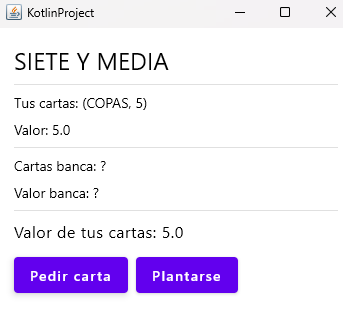
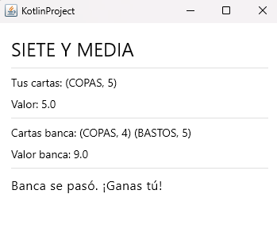

# sieteymediauidesktopcompose
 Es una continuacion de SieteYMedia dos capas 1. Ahora se pide aprovechar la capa de lógica de juego de tu trabajo anterior, SIN MODIFICACIÓN ALGUNA, y utilizarla en una aplicación Compose Desktop.  Puedes ayudarte de IA pero haz algo muy sencillo, que te permita tener el control conceptual, por ejemplo: 
 
En la imagen de arriba se aprecia que elusuario pidió una carta, que es es el 5 de copas. Se observa la suma de sus cartas. La banca aun no comenzó su turno y por lo tanto no observamos cartas

 

Si me planto comienza el turno de la banca y al finalizar su turno se muestra el resultado final

 

Lo importante para nosotros es entender que la clase SieteYMedia es lógica del negocio y  la escribimos independiente de la E/S. No es importante hacer una UI complicada y chulisima
